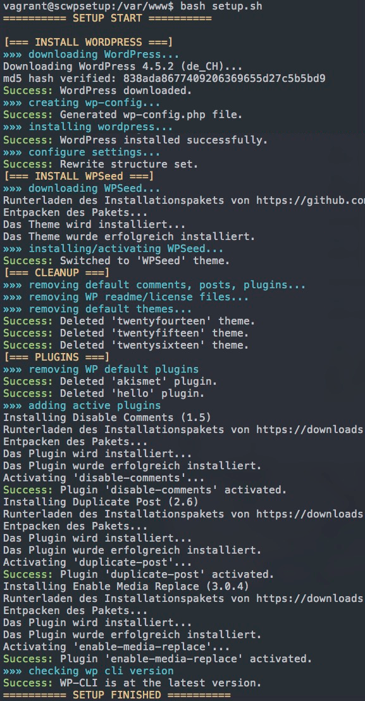

# WordPress Setup for Scotch Box
Version 1.1.2

### What/How/Why
ScWPSetup does all the work for you when setting up a new project with [scotchbox](https://box.scotch.io/). After adding your theme, plugins and environment variables into `config.yml` you simply execute `setup.sh` and it will
- download/install/configure WordPress
- install/activate your favorite WP Theme (default [WPSeed](https://wpseed.org)).
- install/activate the Plugins you defined in the config
- define WordPress options
- clean WordPress defaults (contents, plugins, themes, readme, license)

You can then re-use your config.yml for every other project and save a lot of time clicking, dragging, editing and configurating.

### Requirements:
- running [scotchbox](https://box.scotch.io/) with vagrant/virtualbox (see [getting startet with Scotch Box](https://scotch.io/bar-talk/introducing-scotch-box-a-vagrant-lamp-stack-that-just-works))
- you can use this setup with any other vagrantbox, altough it is written especially for scotchbox.

### Setup
To setup a new project simply follow these steps:
* in your project-root folder (containing `Vagrantfile` and `public`) run
`git clone --depth 1 git@github.com:flurinduerst/ScWPSetup.git && mv ScWPSetup/config.yml config.yml && mv ScWPSetup/setup.sh setup.sh && rm -rf ScWPSetup`
* edit `config.yml` with whatever you need/want
* `vagrant ssh`
* update wp cli (`sudo wp cli update --allow-root` and confirm)
* `cd ../../var/www && bash setup.sh`

the setup will look similar to this:

